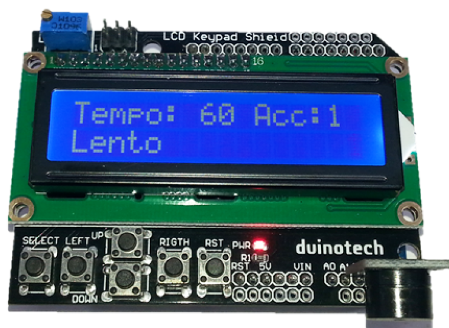

# Metronome
_Project 0004_

We usually think of soldering irons, pliers and oscilloscopes when we think of electronic tools, and while this
project may not be useful to the electronics enthusiast, we think it's a good way of showing how Arduino based
tools can be useful in other fields- in this case for musicians. The Duinotech Metronome has adjustable tempo
between 20 and 240bpm, and can be set to accent anywhere between every beat and every eighth beat. It also
gives a display of the classical name for that tempo.

## Bill of Materials
| Qty | Code | Description |
| --- | --- | ---|
|1 | [XC4410](http://jaycar.com.au/p/XC4410) | Uno Main board
|1 | [XC4454](http://jaycar.com.au/p/XC4454) | LCD button shield
|1 | [XC4424](http://jaycar.com.au/p/XC4424) | Buzzer Module

## Connection Table
the LCD shield fits directly ontop of the Arduino

|Buzzer| LCD Shield|
|---|--- |
|S | A3 |
|- | A5 |

## Downloads
* [Source code](https://github.com/duinotech/Metronome/archive/master.zip)

## Software Libraries
|Library | Author
| --- |--- |

## Assembly
solder the buzzer onto `A3`,`A4`,`A5` of the LCD shield.
Mount the LCD shield ontop of the UNO.

## Programming
Download the source code and extract into a new folder, open the .ino file in the Arduino IDE and press upload.

The sketch for this project uses a few of the libraries that are included with the IDE, so there shouldn't be any
extra libraries to be installed unless you have a very old version of the IDE. You should be able to load the
sketch, select Uno board and its serial port, and upload straight away. The Metronome should start working
straight away. If you don't get any sound, try checking the connection between the Buzzer Module and LCD
Shield. One of the features of the sketch is the use of the Timer interrupt to provide a precise interval between
tones.

## Use

Operation of the Metronome is simple. The buttons have the following functions:

|button | function |
|---|
|Select| Save Current setting to EEPROM
|left| Decrease Tempo
|Right| Increase Tempo
|Up| Increase count between accented beats
|Down| Decrease count between accented beats
|Reset| On reset, the EEPROM settings are loaded, so this can be used to restore settings.

## Future Improvements
Being able to customize a project is what we like about Arduino, and this one is no different. If you don't like the
names and tempi that are displayed, they can be changed in the tempos[] and temponames[] arrays. The notes
that are played as tones can also be changed in the accnote[] array.

As we mentioned earlier, the use of precision timers is essential to this sketch. The slowest the Metronome can
go without overflowing its counter is actually 15bpm, and it can go much faster than 240bpm if necessary,
although the tones might merge into one another if it goes much faster. We've tested this sketch on the Leonardo
too, and it can substitute if you don't have an Uno.

Another feature that could be handy is reprogramming one of the buttons to turn the Metronome on and off if
necessary. We thought a handy feature would be 'follow-the-beat', which is why we put the Buzzer Module on the
analog pins. The plan was to read the Buzzer (they also respond to sound like a microphone), detect the beat
and display it, but we couldn't quite get it working.
